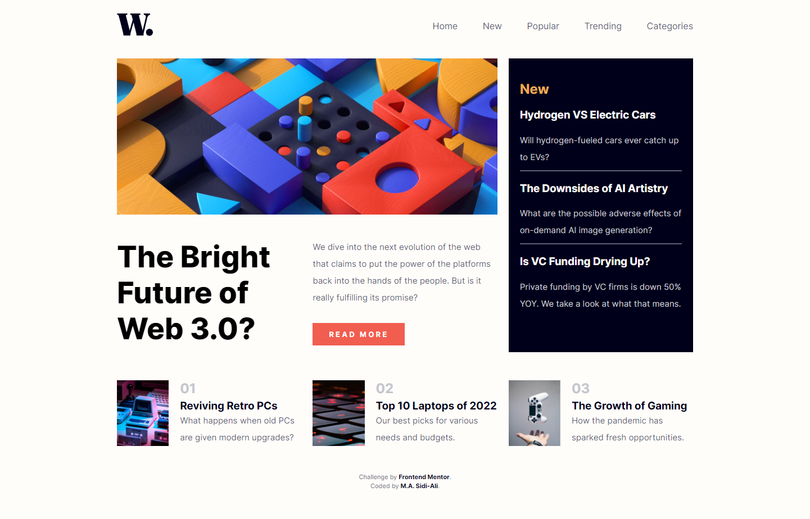

# Frontend Mentor - News homepage solution

This is a solution to the [News homepage challenge on Frontend Mentor](https://www.frontendmentor.io/challenges/news-homepage-H6SWTa1MFl). Frontend Mentor challenges help you improve your coding skills by building realistic projects.

## Table of contents

- [Overview](#overview)
  - [The challenge](#the-challenge)
  - [Screenshot](#screenshot)
  - [Links](#links)
- [My process](#my-process)
  - [Built with](#built-with)
  - [What I learned](#what-i-learned)
  - [Continued development](#continued-development)
  - [Useful resources](#useful-resources)
- [Author](#author)

## Overview

### The challenge

Users should be able to:

- View the optimal layout for the interface depending on their device's screen size
- See hover and focus states for all interactive elements on the page
- **Bonus**: Toggle the mobile menu (requires some JavaScript)

### Screenshot

Below is a screenshot of my solution.



### Links

- Solution URL: [My Solution](https://github.com/Sidi-Ali/grid-news-homepage)
- Live Site URL: [Live Site](https://sidi-ali.github.io/grid-news-homepage/)

## My process
I used a mobile-first workflow to complete this project.

### Built with

- HTML5
- CSS
- CSS Grid
- JavaScript


### What I learned

My major learning while working through this project was using CSS Grid.

```CSS
body{
  display: grid;
}
```

### Continued development

I have used flexbox earlier for this same project. I decided to use CSS Grid for the first time in this project, and I found it to be awesome. So, going forward, I will use  flexbox when I need to design a layout in one dimension, either a row or a column. And I will use CSS Grid when I need to design a layout with two-dimensions (rows and columns at the same time).

### Useful resources

- [Basic_Concepts_of_Grid_Layout](https://developer.mozilla.org/en-US/docs/Web/CSS/CSS_Grid_Layout/Basic_Concepts_of_Grid_Layout)

## Author

- Website - [M. A. Sidi-Ali](https://www.linkedin.com/in/muhammad-adamu-sidi-ali-907a486b/)
- Frontend Mentor - [@Sidi-Ali](https://www.frontendmentor.io/profile/Sidi-Ali)
